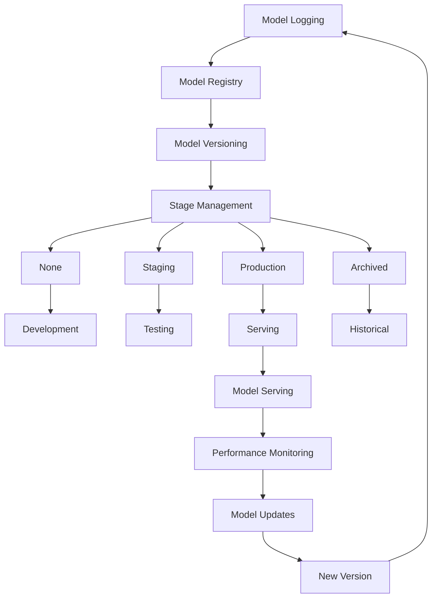

# MLOps Architecture

This document describes the architecture of the MLOps project, including data flow, training pipeline, serving path, and MLflow interactions.

## Overview

The MLOps project implements a complete machine learning pipeline from data ingestion to model serving, with MLflow as the central experiment tracking and model registry system.

## Architecture Components


## Data Flow

### 1. Data Ingestion and Validation


### 2. Feature Engineering


### 3. Model Training Pipeline


### 4. Model Evaluation


### 5. Model Registry and Promotion


### 6. Model Serving

```mermaid
flowchart LR
    A[Production Model] --> B[FastAPI Server]
    B --> C[/healthz]
    B --> D[/predict]
    B --> E[/metrics]
    B --> F[/model-info]
    
    C --> G[Health Status]
    D --> H[Prediction Service]
    E --> I[Prometheus Metrics]
    F --> J[Model Metadata]
    
    H --> K[Input Validation]
    K --> L[Feature Preprocessing]
    L --> M[Model Inference]
    M --> N[Response Formatting]
    
    subgraph "Monitoring"
        O[Request Counters]
        P[Response Times]
        Q[Error Rates]
        R[Model Performance]
    end
    
    H --> O
    H --> P
    H --> Q
    M --> R
```

## Kubernetes Deployment

### 1. Training Jobs


### 2. Serving Deployment


## MLflow Integration

### 1. Experiment Tracking


### 2. Model Registry



## CI/CD Pipeline


## Security and Monitoring

### 1. Security Features

- Non-root Docker containers
- Kubernetes RBAC
- Secrets management
- Network policies
- Pod security standards

### 2. Monitoring Stack


## Data Persistence

### 1. Storage Classes

- **Data PVC**: Training datasets and validation data
- **Artifacts PVC**: Model artifacts and evaluation results
- **MLflow PVC**: Experiment tracking and model registry data

### 2. Backup Strategy

- Automated daily backups
- Point-in-time recovery
- Cross-region replication (optional)
- Retention policies

## Scalability Considerations

### 1. Horizontal Scaling

- HPA for serving pods
- Multiple training job replicas
- Load balancing across instances

### 2. Vertical Scaling

- Resource requests and limits
- GPU scheduling
- Memory optimization
- CPU allocation

### 3. Storage Scaling

- Dynamic volume provisioning
- Storage class selection
- Backup and archival policies

## Disaster Recovery

### 1. Backup Procedures

- Database backups
- Artifact backups
- Configuration backups
- Documentation backups

### 2. Recovery Procedures

- Service restoration
- Data restoration
- Configuration restoration
- Validation procedures

## Performance Optimization

### 1. Training Optimization

- GPU utilization
- Memory management
- Batch size optimization
- Distributed training support

### 2. Serving Optimization

- Model caching
- Request batching
- Async processing
- Connection pooling

### 3. Infrastructure Optimization

- Resource allocation
- Network optimization
- Storage performance
- Monitoring overhead
